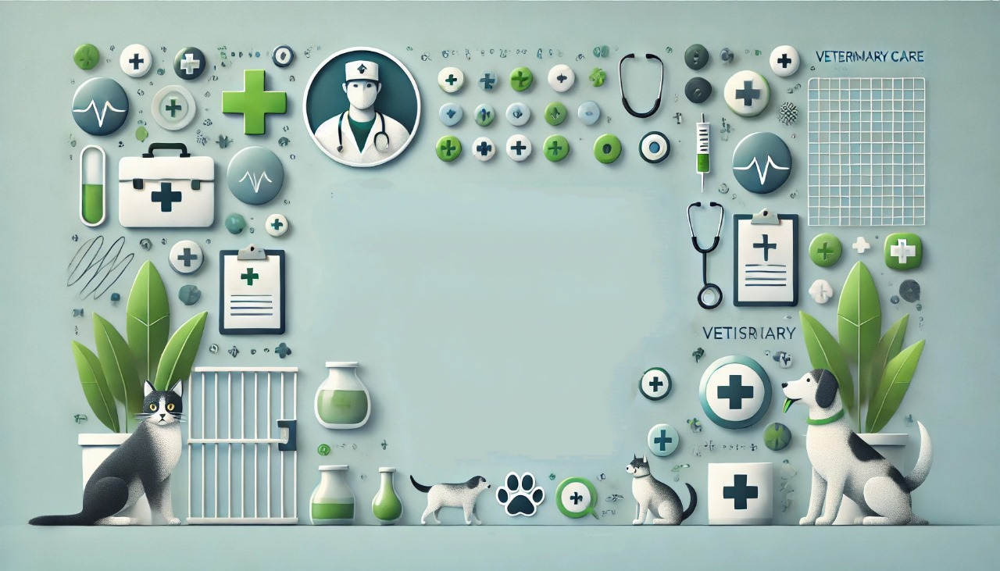

# Sistema de Gestión de Usuarios v1 - Básico

Proyecto de sistema de gestión de usuarios que incluye funcionalidades de inicio y cierre de sesión, así como un panel de control interactivo para administrar datos.

## 📋 Descripción

Este proyecto consiste en una aplicación web diseñada para gestionar usuarios de manera eficiente. Proporciona una interfaz modular y segura, con un diseño básico que permite futuras ampliaciones. El sistema incluye manejo de sesiones para autenticar usuarios y proteger las operaciones dentro del panel.

## 🎨 Capturas de Pantalla

### Pantalla de Inicio de Sesión


### Panel de Control


### Logout Animado


## 🚀 Tecnologías Utilizadas

- **PHP 7.4+**: Lenguaje backend para la lógica del sistema.
- **HTML5 y CSS3**: Interfaz de usuario y diseño visual.
- **JavaScript**: Scripts para mejorar la interactividad.
- **MySQL**: Base de datos para almacenamiento de usuarios y registros.
- **Clean Code y SOLID**: El código sigue estos principios para asegurar modularidad, claridad y mantenimiento.

## 📦 Instalación

1. **Clonar el repositorio**:
    ```bash
    git clone https://github.com/The-Nasa/MC_CONSTRUCION_SW.git
    ```

2. **Configurar la base de datos**:
   - Crea una base de datos en tu servidor MySQL.
   - Configura los detalles en el archivo `etc/config.php`:
     ```php
     $host = 'localhost';
     $namedb = 'nombre_base_de_datos';
     $userdb = 'usuario';
     $passwordb = 'contraseña';
     ```

3. **Ejecutar la aplicación**:
   - Asegúrate de que el servidor web (Apache/Nginx) esté configurado.
   - Accede al sistema en tu navegador mediante `http://localhost/TU_PROYECTO/index.php`.

## 💻 Uso

- **Página de Login**: Los usuarios pueden ingresar sus credenciales para acceder al panel.
- **Panel de Control**: Desde aquí, se pueden realizar operaciones como agregar, modificar y eliminar datos.
- **Logout**: Permite cerrar la sesión de forma segura con una animación SVG personalizada.

## 🌐 Estructura del Código

El sistema está organizado en carpetas para garantizar una buena modularidad:

```plaintext
/controllers/    # Lógica del sistema y controladores.
/css/            # Archivos CSS para el diseño.
/etc/            # Configuración del sistema.
/img/            # Recursos multimedia (imágenes y animaciones).
/js/             # Scripts de JavaScript.
/models/         # Clases para conexión a la base de datos.
/views/          # Vistas del sistema (HTML y PHP).
index.php        # Página principal.
README.md        # Documentación del proyecto.

## 📧 Contacto

Si tienes alguna pregunta o sugerencia, no dudes en contactarme en *[meselemias.tapullima@unas.edu.pe](mailto:meselemias.tapullima@unas.edu.pe)*.

---
*¡Gracias por visitar y contribuir al proyecto!*